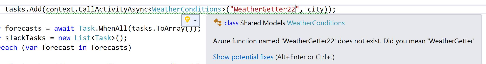

# Durable Functions Analyzer

This is a collection of analyzers to save you from making some common mistakes with [Durable Azure Functions](https://docs.microsoft.com/en-us/azure/azure-functions/durable/durable-functions-overview). 

## The why

Function calls in durable functions are written in a way which can introduce errors in your code which won't be found until run time. In the interests of shifting warnings left these analyzers catch a number of common mistakes.

* Using the wrong name to refer to a function call
* Passing the wrong arguments (not just yet)
* Casting to the wrong return type  (not just yet)

## How to use them